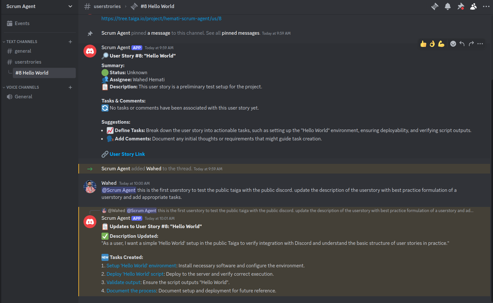
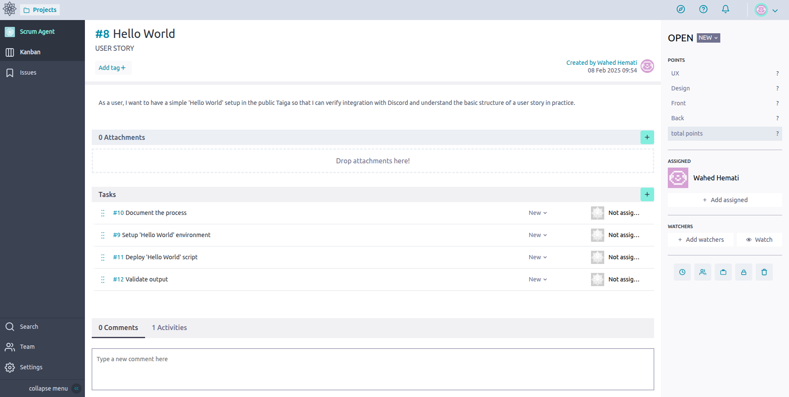
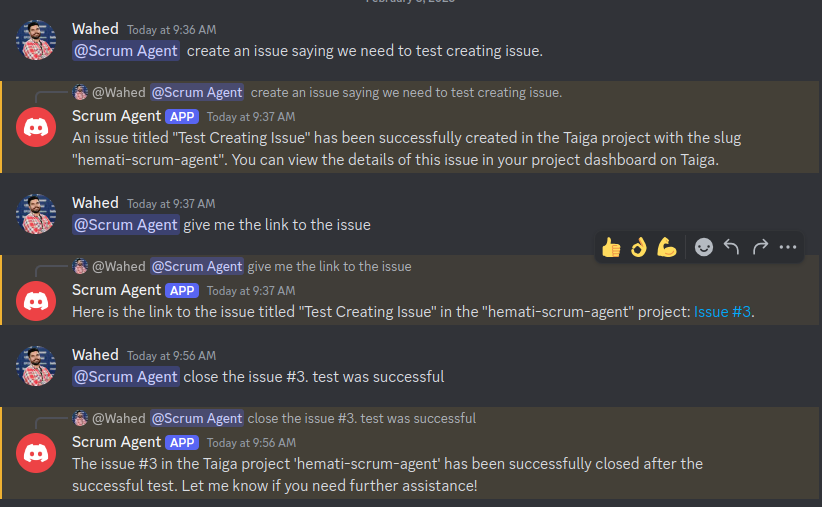
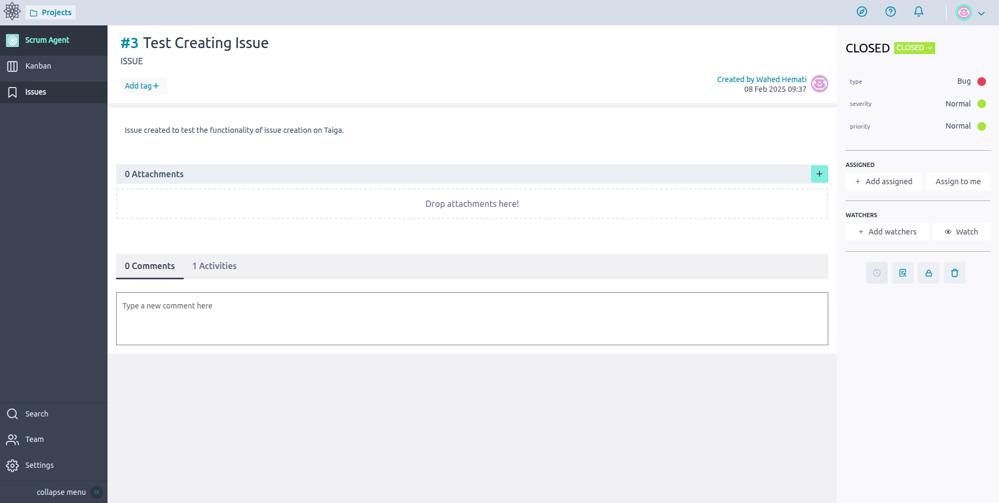
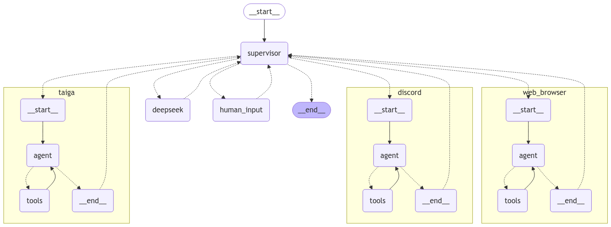

# Scrum Agent


<div align="center">
  <a href="https://discord.gg/ADV99kyfjg" target="_blank" style="margin: 2px;">
    
  </a>
  <a href="https://shikenso.com/" target="_blank" style="margin: 2px;">
    
  </a>
  <a href="https://de.linkedin.com/company/shikenso-gmbh" target="_blank" style="margin: 2px;">
    
  </a>
  <a href="./LICENSE" target="_blank" style="margin: 2px;">
    
  </a>
</div>

---

## Table of Contents

1. [Introduction](#1-introduction)  
2. [Features](#2-features)  
   - [Discord Management](#discord-management)  
   - [Taiga Scrum Master](#taiga-scrum-master)  
   - [Web Tools](#web-tools)  
   - [DeepSeek Reasoning](#deepseek-reasoning)  
3. [Installation and Setup](#3-installation-and-setup)  
   - [Python Project Setup](#python-project-setup)  
   - [Discord Bot Setup](#discord-bot-setup)  
   - [Environment Variables](#environment-variables)  
4. [Usage Examples](#4-usage-examples)  
5. [System Architecture](#5-system-architecture)  
   - [Overview](#overview)  
   - [Adding Agents and Tools](#adding-agents-and-tools)  
6. [Tracing with LangSmith](#6-tracing-with-langsmith)  
7. [Planned Features](#7-planned-features)  
8. [Contact](#8-contact)

---

## 1. Introduction

**Scrum Agent** is an open-source, AI-powered supervisor designed to enhance agile project management within Discord communities. Acting as a virtual Scrum Master, this agent integrates multiple tools to streamline sprint planning, issue tracking, research, and team collaboration.

By mapping individual Discord channels to corresponding Taiga projects, Scrum Agent facilitates seamless user story management through threaded discussions—ensuring efficient workflow management and improved project oversight.

Join our [Discord Server](https://discord.gg/ADV99kyfjg) to test the Scrum Agent and explore its features.

---

## 2. Features

Scrum Agent offers a range of capabilities to support agile project management:

### Discord Management

- **Seamless Integration:**  
  Acts as a central hub for project updates and agile workflow discussions.
  
- **Automated Task Tracking:**  
  Retrieves and organizes sprint-related messages to ensure no detail is overlooked.
  
- **Efficient Search & Retrieval:**  
  Enables quick access to relevant messages, posts, and threads.
  
- **Channel and Thread Organization:**  
  Provides a structured list of channels and active threads for easy navigation.

### Taiga Scrum Master

- **Issue Management:**  
  Track and update sprints, user stories, and tasks efficiently.
  
- **User Story Details:**  
  Retrieve comprehensive information, including history and assigned users.
  
- **Task Updates:**  
  Modify descriptions, update statuses, and assign watchers as needed.
  
- **User Story Creation:**  
  Enhance team collaboration by creating new user stories directly.

### Web Tools

- **DuckDuckGo:**  
  Perform efficient web searches.
  
- **ArXiv:**  
  Access a wide range of research papers.
  
- **YouTube & Wikipedia:**  
  Retrieve information quickly for research or reference.
  
- **Web Navigation:**  
  Gather additional context and relevant data.

### DeepSeek Reasoning

- **Advanced Problem-Solving:**  
  Leverage AI-driven insights to address complex challenges.
  
- **Strategic Analysis:**  
  Enhance decision-making with robust analytical tools.
  
- **Abstract Reasoning:**  
  Gain predictive insights and better understand abstract concepts.

---

## 3. Installation and Setup

### Python Project Setup

1. **Create and activate a Conda environment:**

   ```bash
   conda create -n scrumagent python=3.11 -y
   conda activate scrumagent
   ```

2. **Upgrade pip and install dependencies:**

   ```bash
   pip install --upgrade pip
   pip install -r requirements.txt
   ```

3. **Install Ollama for DeepSeek Agent:**

   Download and install [Ollama](https://ollama.com/download) (adjust size as needed):

   ```bash
   curl -fsSL https://ollama.com/install.sh | sh
   ollama pull deepseek-r1:8b
   ```

---

### Discord Bot Setup

#### 1. Create Your Discord Bot
- **Access the Developer Portal:**  
  Visit the [Discord Developer Portal](https://discord.com/developers/applications) and sign in with your Discord account.
- **Create a New Application:**  
  Click **"New Application"**, give your bot a name, and create the application.

#### 2. Configure OAuth2 Settings
- **Navigate to the OAuth2 Tab:**  
  Once your application is created, click on the **OAuth2** tab.
- **Enable the Bot Option:**  
  In the OAuth2 settings, activate the **"bot"** option.
- **Set Bot Permissions:**  
  Under the **OAuth2 Bot Permissions** section, ensure that the following permissions are enabled:
  - **View Channels**
  - **Send Messages**
  - **Create Public Threads**
  - **Create Private Threads**
  - **Send Messages in Threads**
  - **Read Message History**
  - **Add Reactions**
- **Enable Intents:**  
  Go to the **"Bot"** tab and enable:
  - **Server Members Intent**
  - **Message Content Intent**

#### 3. Add the Bot to Your Server
- **Generate the OAuth2 URL:**  
  After configuring the permissions, generate the OAuth2 URL.
- **Invite the Bot:**  
  Use the generated URL to invite the bot to your Discord server, and follow the on-screen instructions to complete the process.

#### 4. Retrieve Your Bot Token
1. **Go to the "Bot" Tab:**  
   In your application settings, click on the **"Bot"** tab in the sidebar.
2. **Reveal the Token:**  
   Under the **"Build-A-Bot"** section, locate the **"Token"** field. Click the **"Reset Token"** or **"View Token"** button to reveal your bot token.  
   > **Important:** Never share your bot token publicly or commit it to version control. Treat it like a password.
3. **Copy Your Token:**  
   Copy the bot token for the next step.
4. **Add the Token to Your `.env` File:**  
   - If you haven’t created a `.env` file, copy `.env.example` to `.env`.
   - Add the following line to your `.env` file:
     ```bash
     DISCORD_TOKEN=YOUR_DISCORD_BOT_TOKEN_HERE
     ```

---

### Environment Variables

1. **Set Up Environment Variables:**
   - Copy the file `.env.example` and rename it to `.env`.
   - Open the new `.env` file and fill in the required details.

2. **Customize the Mapping:**
   - Copy `config/taiga_discord_maps.yaml.example` and rename it to `config/taiga_discord_maps.yaml`.
   - Edit this file as needed to match your project settings.

---

## 4. Usage Examples

Below are examples showing **how to create and update Taiga issues or user stories** directly from Discord. Changes made in Discord appear in Taiga, making project management faster and easier.

### Updating a User Story

<p align="center">
  
  
</p>

**Left:** Updating a user story in Discord  
**Right:** The updated user story in Taiga

### Creating or Updating an Issue

<p align="center">
  
  
</p>

**Left:** Creating or updating an issue in Discord  
**Right:** The newly created or updated issue in Taiga


### Try It Out!

Join our [Discord Server](https://discord.gg/ADV99kyfjg) to test the Scrum Agent and explore its features.

---

## 5. System Architecture

### Overview

Scrum Agent is built on the [Langgraphs Supervisor Agent](https://langchain-ai.github.io/langgraph/tutorials/multi_agent/agent_supervisor/), which allows for flexible integration of multiple agents and tools. For more technical details, please refer to the Langgraphs documentation.

#### Architecture Diagram

  
*Figure: Architecture diagram of Scrum Agent's multi-agent setup.*

### Adding Agents and Tools

- **Adding Agents:**  
  Insert new agent nodes in `build_agent_graph.py`.

- **Supervisor Configuration:**  
  Update `supervisor_agent.py` with the agent's name and description. Ensure that the names are consistent.

- **Tool Integration:**  
  Follow the [Langgraphs Documentation](https://python.langchain.com/docs/integrations/tools/) for guidance on adding and integrating additional tools.

---

## 6. Tracing with LangSmith

To enable tracing with LangSmith, follow these steps:

1. **Set Environment Variables:**
   ```bash
   LANGCHAIN_TRACING_V2=True
   LANGCHAIN_API_KEY=your_api_key_here
   LANGCHAIN_PROJECT=your_project_name
   ```
   Replace `your_api_key_here` with your actual API key (refer to `.env.example` for guidance).

2. **Learn More:**
   - [Tracing Documentation](https://docs.smith.langchain.com/observability/how_to_guides/tracing/trace_with_langgraph)
   - [LangSmith Website](https://smith.langchain.com/)

This configuration allows you to monitor and trace your application's activity using LangSmith.

---

## 7. Planned Features

- **Enhanced Long-Term Memory:**  
  Integration of searchable long-term memory for specific agents.  
  References:
  - [Memory Agent Repository](https://github.com/langchain-ai/memory-agent)
  - [Long Term Memory Documentation](https://python.langchain.com/docs/versions/migrating_memory/long_term_memory_agent/)
  
- **Multi-Server Support:**  
  Expanding bot capabilities to support multiple Discord servers (currently limited to one).

- **Roadmap:**
  See the [Taiga Project](https://tree.taiga.io/project/hemati-scrum-agent/kanban) for the latest updates and planned features.

---

## 8. Contact

For inquiries, support, or contributions, please open an issue [here](https://github.com/Shikenso-Analytics/ScrumAgent/issues) or at [Taiga](https://tree.taiga.io/project/hemati-scrum-agent/issues) 
or join our [Discord](https://discord.gg/ADV99kyfjg).
